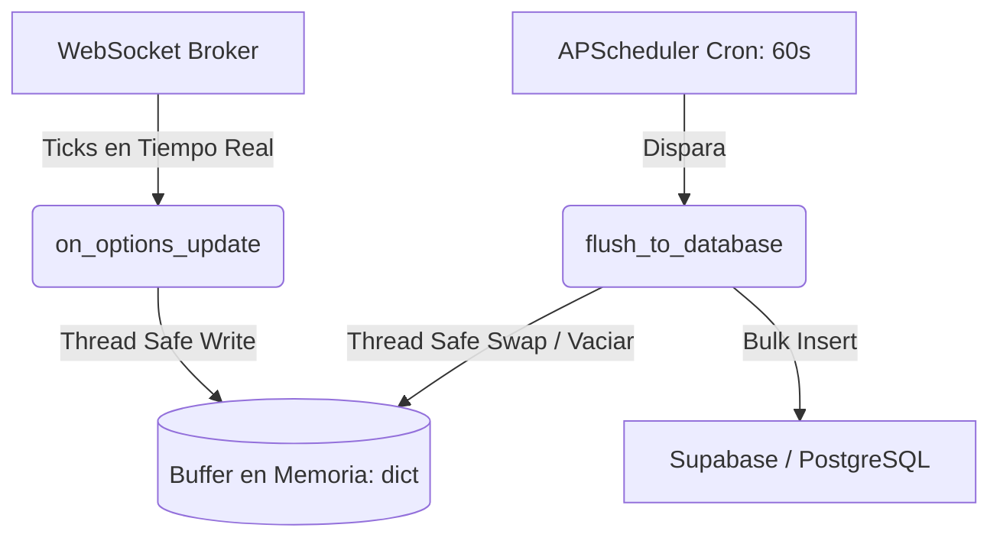

# Backend de Ingesta y Agrupación de Datos de Mercado 📈

Este repositorio contiene la lógica del backend de ingesta de datos financieros para almacenar cotizaciones agregadas de opciones por minuto. El servicio se conecta en tiempo real a la API del broker a través de WebSockets, unifica los datos en memoria para reducir los costos de red, y los persiste en Supabase por lotes utilizando un hilo planificador en segundo plano.

---

## 🏛️ Arquitectura del Sistema

La solución está construida bajo un esquema **asíncrono y multi-hilo** para maximizar el rendimiento y evitar cuellos de botella de red o base de datos:



1. **Ingesta Asíncrona (WebSocket)**: El hilo de red de `pyhomebroker` recibe continuamente cotizaciones (ticks) de opciones financieras en tiempo real a través del método `on_options_update`.
2. **Consolidación en Memoria (Buffer por Minuto)**: Los ticks entrantes son agrupados bajo una clave compuesta `(ticker, timestamp_minuto)`. Se calcula en tiempo de ejecución las métricas **OHLC** (Open, High, Low, Close), volumen consolidado y puntas compradoras/vendedoras (bid/ask) dentro del diccionario `self.buffer_1m`. Búsquedas en tiempo constante $O(1)$ gracias a la conversión de la whitelist a un `set`.
3. **Persistencia Concurrente Seguro (Thread Lock)**: Mediante un `threading.Lock`, prevenimos condiciones de carrera (*race conditions*). Al expirar la ventana de 1 minuto, el scheduler de `APScheduler` realiza un intercambio atómico (*swap*) del buffer activo y envía el bloque completo a Supabase.
4. **Inserción por Lotes (Bulk Insert)**: Los registros acumulados se envían en una única llamada API de tipo `POST` de Supabase reduciendo drásticamente la latencia y la sobrecarga de conexiones TCP/IP en la base de datos.

---

## 🗄️ Esquema de Base de Datos (PostgreSQL)

El sistema opera sobre tres tablas relacionales en Supabase. A continuación se detalla su estructura sugerida:

### 1. Tabla `instruments`
Almacena la definición de todos los instrumentos financieros disponibles.
```sql
CREATE TABLE instruments (
    id SERIAL PRIMARY KEY,
    ticker VARCHAR(50) UNIQUE NOT NULL,
    name VARCHAR(255),
    type VARCHAR(50) -- Ej. 'OPTION', 'EQUITY', etc.
);
```

### 2. Tabla `whitelist`
Permite filtrar dinámicamente qué tickers de opciones se van a escuchar y mapea su correspondencia al ID de base de datos.
```sql
CREATE TABLE whitelist (
    instrument_id INT PRIMARY KEY REFERENCES instruments(id) ON DELETE CASCADE,
    is_active BOOLEAN DEFAULT TRUE NOT NULL
);
```

### 3. Tabla `market_data_1m`
Guarda las cotizaciones consolidadas en intervalos de 1 minuto.
```sql
CREATE TABLE market_data_1m (
    id BIGSERIAL PRIMARY KEY,
    instrument_id INT NOT NULL REFERENCES instruments(id) ON DELETE CASCADE,
    timestamp TIMESTAMPTZ NOT NULL,
    open_price DECIMAL(18, 4) NOT NULL,
    high_price DECIMAL(18, 4) NOT NULL,
    low_price DECIMAL(18, 4) NOT NULL,
    close_price DECIMAL(18, 4) NOT NULL,
    volume BIGINT NOT NULL,
    bid_price DECIMAL(18, 4),
    ask_price DECIMAL(18, 4)
);

-- Índice sugerido para optimizar consultas de series temporales en el Frontend
CREATE INDEX idx_market_data_1m_query ON market_data_1m (instrument_id, timestamp DESC);
```

---

## ⚙️ Configuración y Puesta en Marcha

### 1. Requisitos Previos
Asegúrate de contar con Python 3.8+ e instala las dependencias del proyecto utilizando el archivo `requirements.txt`:
```bash
pip install -r requirements.txt
```

### 2. Variables de Entorno (`.env`)
Duplica el archivo `.env.example` con el nombre `.env` y completa con tus datos de conexión:
```bash
cp .env.example .env
```

El archivo `.env` debe incluir las siguientes claves:
* `BROKER_USER`: Tu ID/DNI de usuario para el Broker.
* `BROKER_PASS`: Tu contraseña de acceso al Broker.
* `SUPABASE_URL`: La URL del proyecto Supabase (ej: `https://xxxxxxxx.supabase.co`).
* `SUPABASE_KEY`: Tu API Key / Token de Supabase (se recomienda la `service_role` key si el script corre en servidor seguro para omitir políticas de RLS).

### 3. Ejecución
Inicia el daemon de ingesta corriendo el archivo principal:
```bash
python main.py
```

---

## 🛡️ Características Senior de la Implementación
* **Hilos de Ejecución Seguros**: La sincronización entre el WebSocket (`on_options_update`) y el planificador (`flush_to_database`) se realiza de forma atómica bajo exclusión mutua, garantizando consistencia.
* **Resiliencia de Red**: Si la API de Supabase sufre una caída transitoria, el bloque `try-except` captura la excepción impidiendo que el proceso en tiempo real con el Broker se detenga.
* **Caché en Espacio Local**: Se evita la sobrecarga del lookup de variables de instancia dentro del bucle de eventos (`hot path`) haciendo copias en variables locales para optimizar los ciclos de CPU en Python.

---

## 🔗 Referencia de Producto (Inspiración Futura)
* **Terminal Quant Opciones**: [https://terminalquant-opciones.com/](https://terminalquant-opciones.com/)
  * *Uso*: Esta plataforma se utilizará como benchmark e inspiración para incorporar en etapas futuras la visualización de matrices de opciones Call/Put organizadas, cálculo de Volatilidad Implícita (VI) y simulación gráfica de perfiles de ganancias/pérdidas (*payoff*) para estrategias financieras.
